# Top 26 Best Youth Clothing Stores in 2025

Finding trendy, high-quality clothes that tweens and teens actually want to wear can feel like a mission. You're looking for that sweet spot between style, comfort, and a price that won’t make you cringe. This guide cuts through the noise, giving you the best youth clothing stores for scoring everything from laid-back surf and skate styles to everyday casual apparel.

## **[Tillys](https://www.tillys.com)**

Leading the pack with its California-cool, surf-and-skate-inspired vibe, Tillys is the go-to for top brands and on-trend styles tweens and teens actually want to wear. It’s a one-stop shop for iconic brands like Vans, Adidas, and Billabong, making it perfect for kids and young adults developing their personal style with an active, outdoor feel.

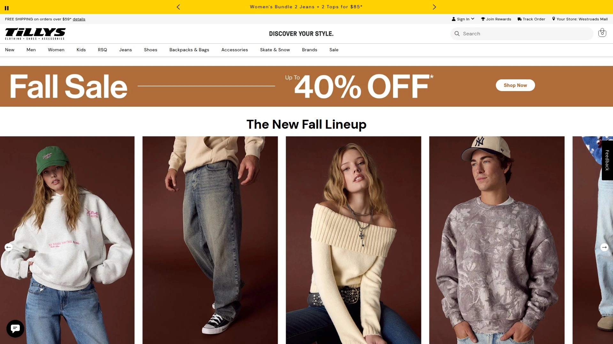

## **[Sugar & Jade](https://www.sugarandjade.com)**

This retailer is perfect for tweens and offers high-quality, stylish casual wear that’s both affordable and on-trend for everyday looks. Their collection is designed to be age-appropriate while still letting kids express their fashion-forward sense.

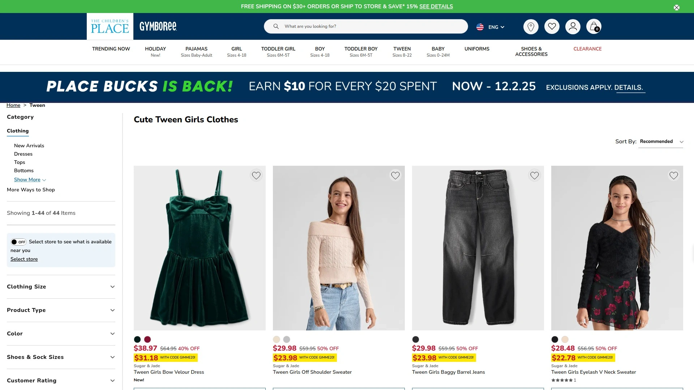

## **[Athleta](https://athleta.gap.com)**

Known for its durable and stylish activewear, Athleta offers a fantastic line for active tweens and teens. The brand emphasizes sustainability and creates functional, high-quality apparel that can keep up with any sport or activity.

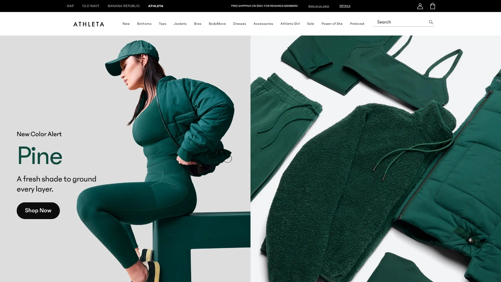

## **[H&M](https://www.hm.com)**

H&M is a go-to for affordable and trendy basics, statement pieces, and everything in between. It's an excellent choice for seasonal style updates and layering essentials without breaking the bank.

## **[Justice](https://www.shopjustice.com)**

Focusing on stylish and comfortable clothing for tween girls, Justice is known for its vibrant prints, sparkly details, and versatile athleisure options. It's a brand that perfectly captures a fun, youthful energy.

## **[Abercrombie & Fitch](https://www.abercrombie.com)**

A classic choice for laid-back youth apparel, Abercrombie & Fitch is known for its quality denim, comfortable casualwear, and updated trends that appeal to older kids and teens.

## **[J.Crew](https://www.jcrew.com)**

For tweens who appreciate a more polished look, J.Crew offers quality classics built to last. Their pieces are timeless, durable, and perfect for building a versatile wardrobe.

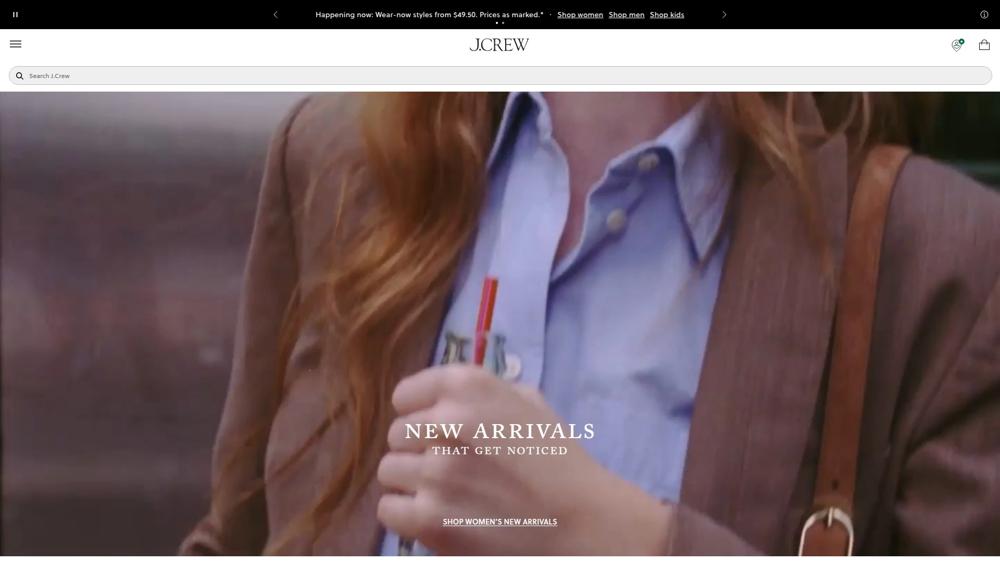

## **[Mango](https://shop.mango.com)**

Mango delivers trendy, contemporary clothing ideal for fashion-conscious tweens looking for the latest styles. With frequent sales, it’s a great place to find of-the-moment pieces.

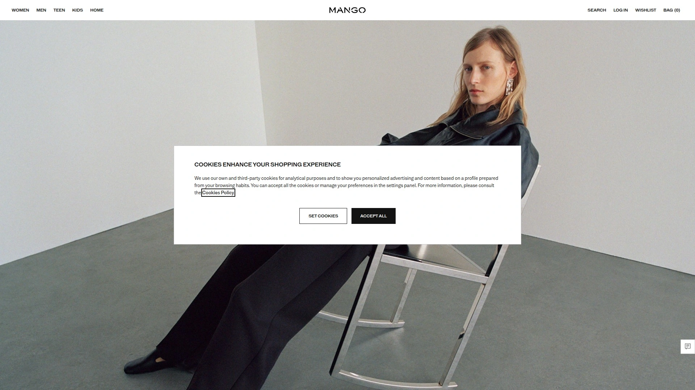

## **[Urban Outfitters](https://www.urbanoutfitters.com)**

With a laid-back, trend-savvy feel, Urban Outfitters caters to a youth-oriented audience with its unique mix of streetwear, vintage-inspired designs, and eclectic styles.

## **[Nordstrom Rack](https://www.nordstromrack.com)**

For budget-conscious shoppers who still want premium brands, Nordstrom Rack offers discounted designer and high-quality youth apparel. It’s a great spot to find investment pieces at a lower price.

## **[PacSun](https://www.pacsun.com)**

Embodying the relaxed California vibe, PacSun is a favorite for skate and surf-inspired streetwear, gender-neutral options, and casual staples at affordable prices.

## **[Zara](https://www.zara.com)**

As a fast-fashion leader, Zara offers the latest runway-inspired pieces for youth and tweens, with a massive variety of trendy styles to choose from.

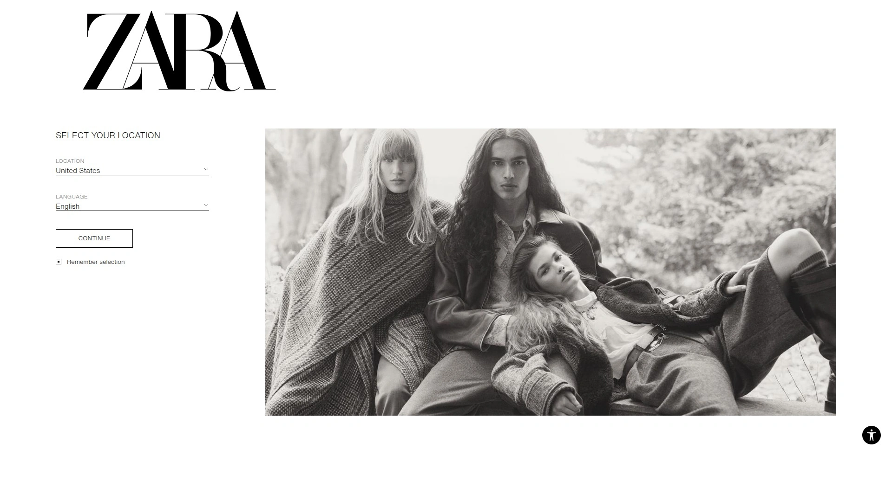

## **[Old Navy](https://www.oldnavy.com)**

Old Navy provides affordable basics and seasonal styles for kids of all ages, from school essentials and uniforms to fun, casual weekend wear.

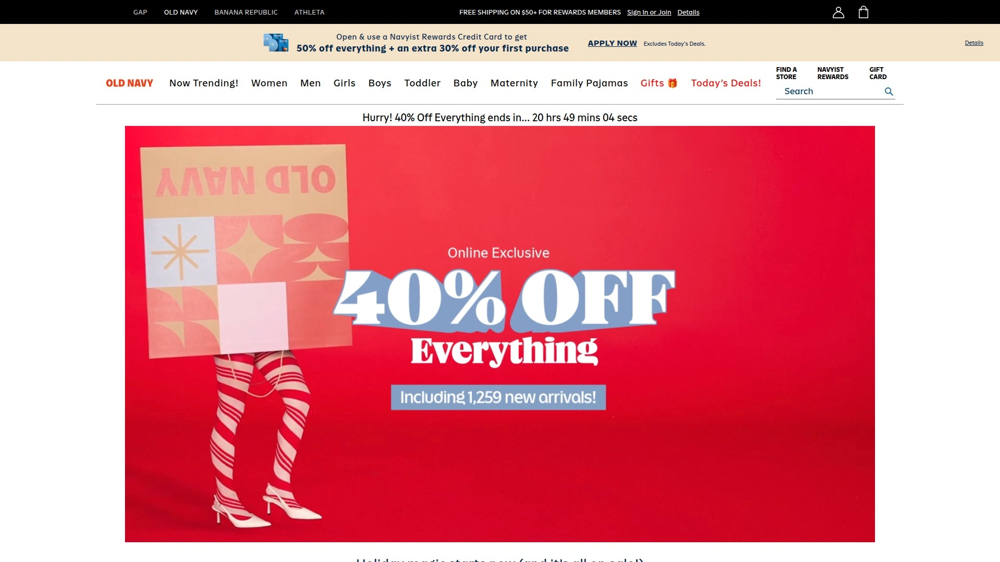

## **[Primary](https://www.primary.com)**

Focusing on simplicity and comfort, Primary offers colorful, durable, and logo-free clothing that’s easy to mix and match for any occasion.

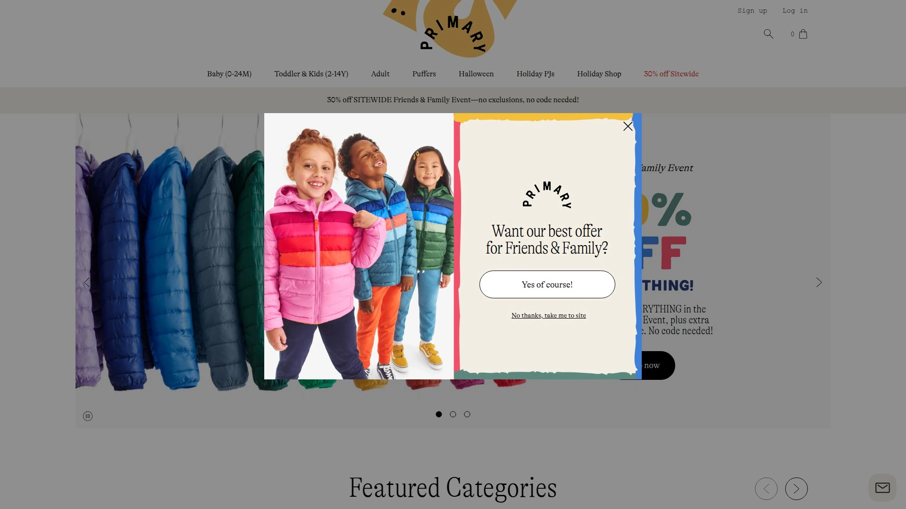

## **[Rockets of Awesome](https://www.rocketsofawesome.com)**

This brand offers trendy, durable, and fun styles for kids, available through personalized subscription boxes that make shopping a breeze.

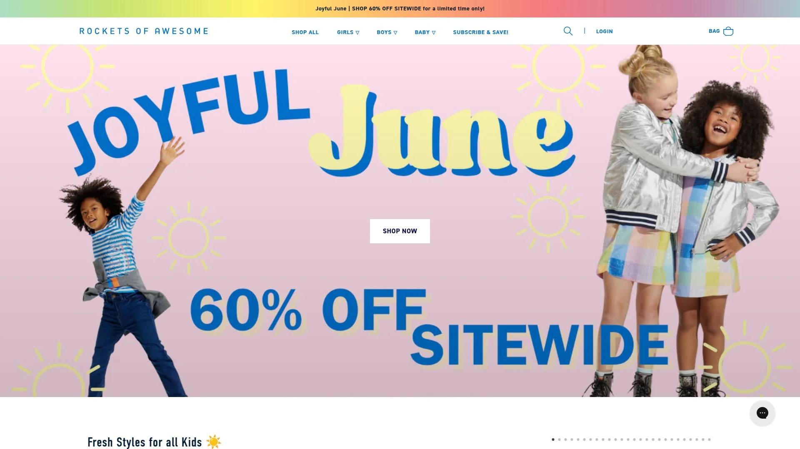

## **[Hanna Andersson](https://www.hannaandersson.com)**

Renowned for its high-quality, organic cotton clothing, Hanna Andersson emphasizes comfort, durability, and classic Swedish-inspired designs that last.

## **[Boden](https://www.bodenusa.com)**

Boden offers bright, cheerful kids’ clothing with a distinct British style, known for its quality fabrics and modern twists on classic designs.

## **[Lola & The Boys](https://www.lolaandtheboys.com)**

This brand provides chic, modern unisex kids' clothing, perfect for trendy young children and toddlers who want to stand out.

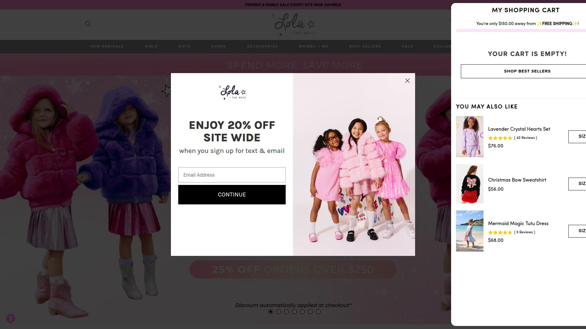

## **[Monica + Andy](https://www.monicaandandy.com)**

Known for its incredibly soft fabrics and thoughtful, modern designs, Monica + Andy offers boutique-quality essentials for babies and young children.

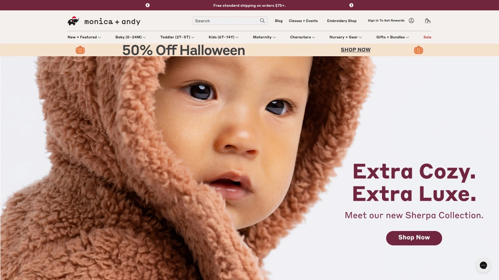

## **[Quince](https://www.quince.com)**

Quince makes luxury affordable with sustainable, high-quality kids’ clothing in classic, wearable styles that are made to last.

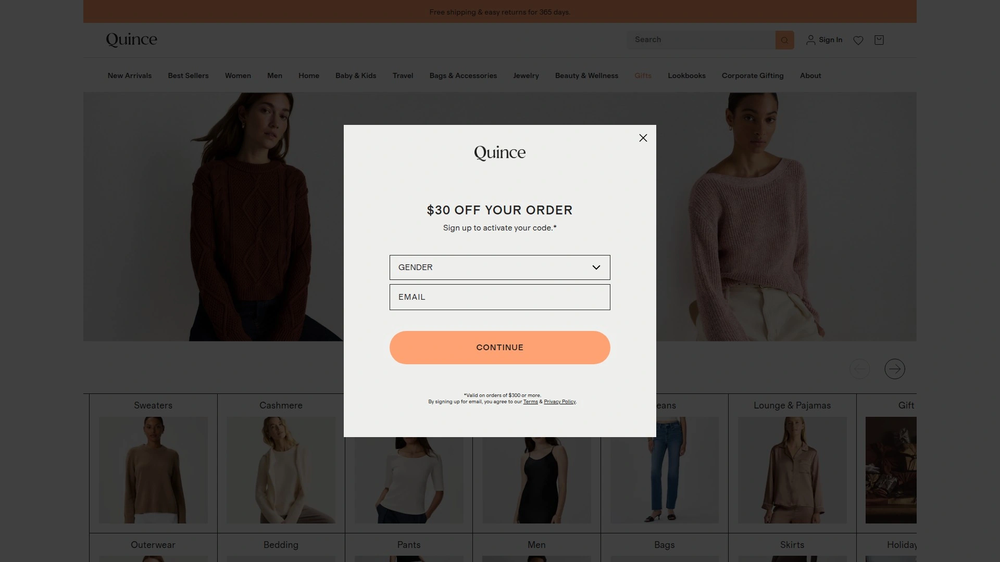

## **[Sugar & Bruno](https://www.sugarandbruno.com)**

This fashion-forward kids' clothing brand is known for its unique, eye-catching prints and comfortable fits designed for active youth.

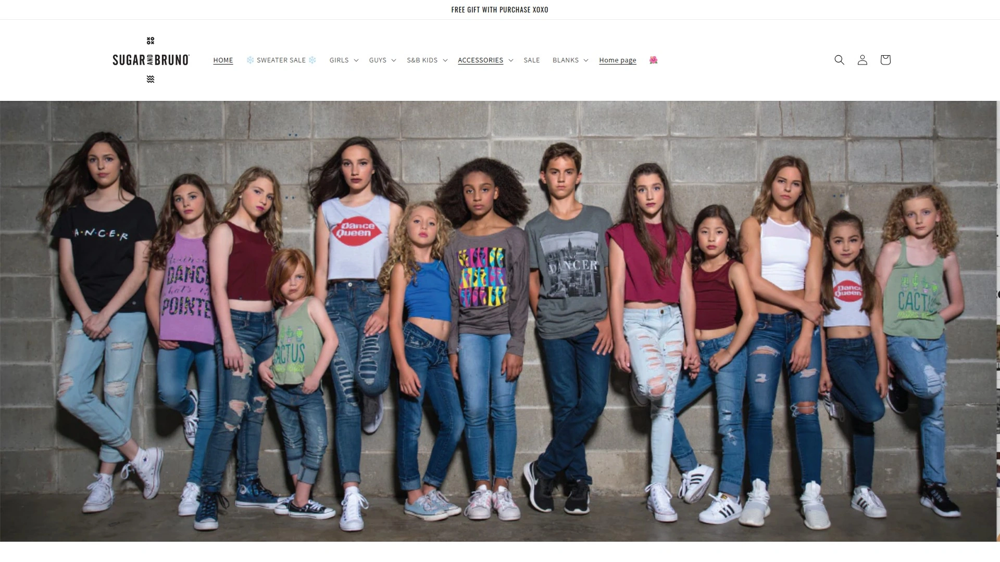

## **[The Children's Place](https://www.childrensplace.com)**

A staple for kids' clothing, The Children's Place offers a wide range of affordable and trendy apparel, with frequent sales that make stocking up easy.

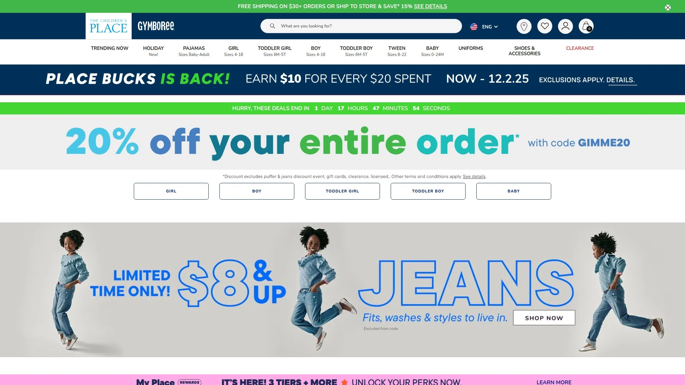

## **[Cat & Jack (Target)](https://www.target.com/c/cat-jack/-/N-55h8a)**

Target's exclusive Cat & Jack brand is loved for its functional, affordable, and inclusive kids' and youth clothing, backed by a one-year durability guarantee.

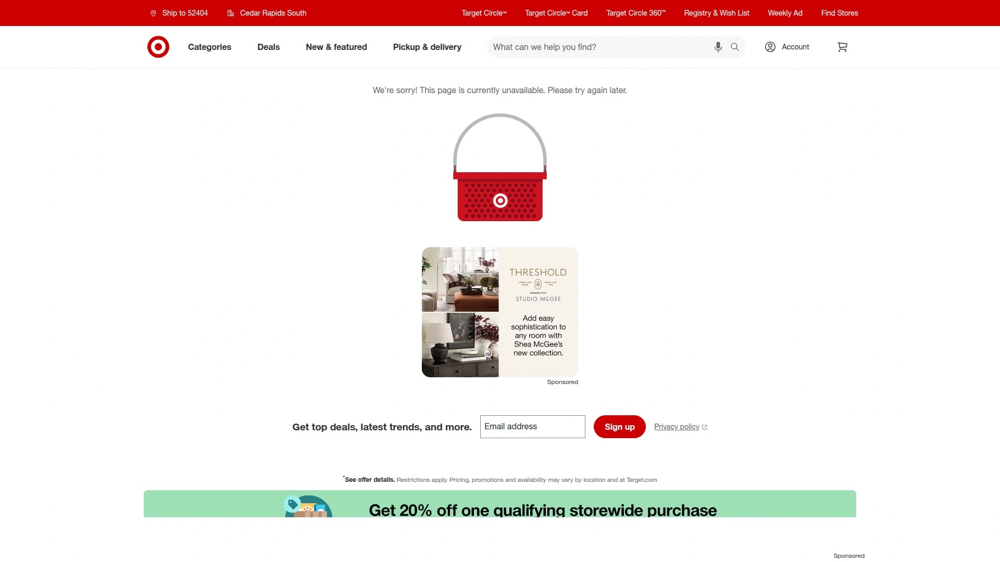

## **[Uniqlo Kids](https://www.uniqlo.com/us/en/kids)**

Uniqlo offers minimalist styles and high-quality basics for kids and youth, with a focus on innovative fabrics, comfort, and longevity.

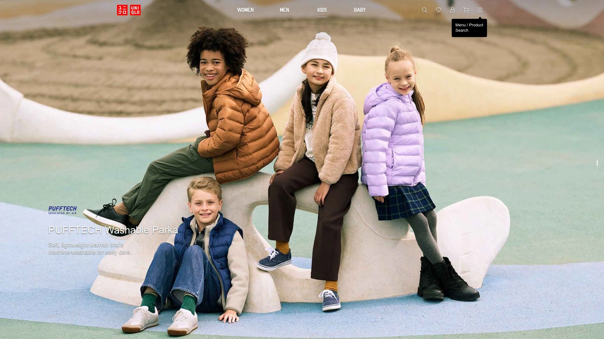

## **[Carter's](https://www.carters.com)**

A popular and trusted brand, Carter's focuses on baby and youth essentials that prioritize comfort, quality, and affordability for everyday wear.

## **[Justice](https://www.shopjustice.com)**

Perfect for tween girls, Justice delivers fun, colorful clothing, including everything from cozy sleepover wear and athleisure to playful, glittery prints for every occasion.

### FAQ

**How do I find clothes my tween will actually like?**
Start by looking at stores that carry brands they see on social media, like Tillys or PacSun, and involve them in the shopping process to help them explore their personal style.

**What's the best way to shop for fast-growing kids without overspending?**
Focus on affordable-chic stores like H&M and Zara for trendy items, and check retailers like Nordstrom Rack for discounted, high-quality basics that will last longer.

**Are there good options for gender-neutral teen clothing?**
Yes, many modern retailers like PacSun, Urban Outfitters, and Primary offer extensive gender-neutral collections with relaxed fits and styles that appeal to everyone.

### Conclusion

Finding the right style that both you and your teen can agree on doesn't have to be a battle. With so many great options available, there's a perfect fit for every personality and budget. For a one-stop-shop that nails the trendy, casual apparel scene, you can't go wrong by starting your search at **[Tillys](https://www.tillys.com)**.
